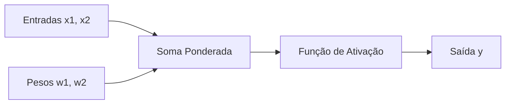

# 🧠 Implementação de Rede Neural Perceptron

<div align="center">


*Uma implementação educacional de Perceptron em Python puro para compreender os fundamentos das redes neurais artificiais*

</div>

---

## 📋 Sumário

- [🎯 Sobre o Projeto](#-sobre-o-projeto)
- [🔧 Tecnologias Utilizadas](#-tecnologias-utilizadas)
- [📊 Resultados Obtidos](#-resultados-obtidos)
- [🚀 Como Executar](#-como-executar)
- [📖 Conceitos Fundamentais](#-conceitos-fundamentais)
- [📈 Processo de Treinamento](#-processo-de-treinamento)
- [🧮 Fórmulas Matemáticas](#-fórmulas-matemáticas)
- [📁 Estrutura do Projeto](#-estrutura-do-projeto)
- [🎓 Aprendizados](#-aprendizados)
- [👥 Contribuição](#-contribuição)
- [📄 Licença](#-licença)

---

## 🎯 Sobre o Projeto

Este projeto implementa um **Perceptron** do zero em Python, sem o uso de bibliotecas externas de machine learning, com o objetivo de solidificar o entendimento sobre redes neurais artificiais e algoritmos de aprendizado de máquina.

### ✨ Características Principais

- 🔬 **Implementação Pura**: Código Python sem dependências externas
- 📚 **Fins Educacionais**: Explicações detalhadas de cada conceito
- 📊 **Visualização Detalhada**: Acompanhamento do processo de treinamento época por época
- 🎯 **Convergência Garantida**: Modelo converge para erro zero em dados linearmente separáveis

### 🏢 Aplicações Práticas

O Perceptron pode ser aplicado em diversos cenários corporativos:

- 🛒 **E-commerce**: Previsão de produtos com potencial de viralização
- 👥 **Marketing**: Identificação de potenciais compradores
- 🔍 **Recomendação**: Classificação de preferências de usuários
- 📦 **Logística**: Previsão de tempos de entrega
- 🔐 **Segurança**: Detecção de atividades fraudulentas

---

## 🔧 Tecnologias Utilizadas

| Tecnologia | Versão | Uso |
|------------|--------|-----|
|  | 3.7+ | Linguagem principal |
|  | Latest | Ambiente de desenvolvimento |
|  | - | Documentação |

---

## 📊 Resultados Obtidos

### 🏆 Métricas de Performance

| Métrica | Valor |
|---------|-------|
| **Épocas até Convergência** | 12 |
| **Taxa de Aprendizagem** | 0.1 |
| **Erro Final** | 0 (Zero) |
| **Peso Final W1** | 0.23 |
| **Peso Final W2** | -0.14 |

### 📈 Evolução do Treinamento

```
Época  1: Erros = 1  | W1 = 0.20, W2 = -0.10
Época  2: Erros = 2  | W1 = 0.18, W2 = -0.14
...
Época 12: Erros = 0  | W1 = 0.23, W2 = -0.14 ✅ CONVERGIU!
```

> 🎯 **Sucesso**: O modelo convergiu com **erro zero** na **12ª época**, demonstrando eficácia na classificação dos dados linearmente separáveis.

---

## 🚀 Como Executar

### 📋 Pré-requisitos

```bash
# Verificar versão do Python
python --version  # Python 3.7+

# Instalar Jupyter (opcional)
pip install jupyter
```

### ▶️ Executando o Projeto

1. **Clone o repositório**
   ```bash
   git clone https://github.com/seu-usuario/perceptron-implementation.git
   cd perceptron-implementation
   ```

2. **Execute o notebook**
   ```bash
   jupyter notebook perceptron.ipynb
   ```

3. **Ou abra diretamente no Jupyter Lab**
   ```bash
   jupyter lab perceptron.ipynb
   ```

---

## 📖 Conceitos Fundamentais

### 🧮 O que é um Perceptron?

O **Perceptron** é a forma mais simples de uma rede neural artificial, inspirado no funcionamento dos neurônios biológicos. Ele processa informações através de três etapas principais:



### 🔄 Processo de Funcionamento

| Etapa | Descrição | Fórmula |
|-------|-----------|---------|
| **1. Combinação Linear** | Multiplica entradas pelos pesos | `u = (x1 × w1) + (x2 × w2)` |
| **2. Função de Ativação** | Aplica função degrau | `y = 1 se u ≥ 0, senão 0` |
| **3. Ajuste de Pesos** | Corrige erros usando regra delta | `w_novo = w_atual + η × erro × x` |

---

## 📈 Processo de Treinamento

### 🎯 Dados de Treinamento

```python
dados_treinamento = [
    {"x1": 0.5, "x2": 0.8, "saida_desejada": 1},  # Classe positiva
    {"x1": 0.2, "x2": 0.4, "saida_desejada": 0},  # Classe negativa
]
```

### ⚙️ Parâmetros do Modelo

| Parâmetro | Valor | Descrição |
|-----------|-------|-----------|
| **Pesos Iniciais** | `[0.2, -0.1]` | Valores aleatórios iniciais |
| **Taxa de Aprendizagem** | `0.1` | Controla velocidade de ajuste |
| **Limite de Épocas** | `20` | Máximo de iterações |

### 🔄 Algoritmo de Treinamento

```python
for epoca in range(limite_epocas):
    erro_na_epoca = False
    for dado in dados_treinamento:
        # 1. Calcular saída
        u = x1 * w1 + x2 * w2
        saida = 1 if u >= 0 else 0
        
        # 2. Calcular erro
        erro = saida_desejada - saida
        
        # 3. Ajustar pesos (se necessário)
        if erro != 0:
            w1 += taxa_aprendizagem * erro * x1
            w2 += taxa_aprendizagem * erro * x2
            erro_na_epoca = True
    
    # 4. Verificar convergência
    if not erro_na_epoca:
        print(f"Convergiu na época {epoca}!")
        break
```

---

## 🧮 Fórmulas Matemáticas

### 📐 Combinação Linear
```
u = Σ(xi × wi) = x1×w1 + x2×w2
```

### 🔀 Função de Ativação (Degrau)
```
f(u) = {
    1, se u ≥ 0
    0, se u < 0
}
```

### 📊 Regra Delta (Ajuste de Pesos)
```
wi(novo) = wi(atual) + η × erro × xi
```

**Onde:**
- `η` (eta) = taxa de aprendizagem
- `erro` = saída_desejada - saída_predita
- `xi` = valor da entrada i

---

## 📁 Estrutura do Projeto

```
perceptron-implementation/
│
├── 📓 perceptron.ipynb          # Notebook principal com implementação completa
└── 📄 README.md                 # Este arquivo com documentação do projeto
```

### 📋 Descrição dos Arquivos

| Arquivo | Descrição |
|---------|-----------|
| `perceptron.ipynb` | Jupyter Notebook contendo toda a implementação do Perceptron, explicações teóricas detalhadas e resultados do treinamento |
| `README.md` | Documentação principal do projeto com visão geral, instruções e conceitos fundamentais |

---

## 🎓 Aprendizados

### ✅ O que Funciona Bem

- ✔️ **Dados Linearmente Separáveis**: Perceptron garante convergência
- ✔️ **Implementação Simples**: Código limpo e compreensível
- ✔️ **Interpretabilidade**: Pesos finais têm significado claro

### ⚠️ Limitações Identificadas

- ❌ **Dados Não-Lineares**: Não consegue classificar (ex: XOR)
- ❌ **Apenas Binário**: Limitado a classificação de duas classes
- ❌ **Sensibilidade**: Performance depende dos pesos iniciais

### 🧠 Insights dos Pesos Finais

| Peso | Valor | Interpretação |
|------|-------|---------------|
| **W1** | `+0.23` | Influência **positiva** - aumenta probabilidade de classe 1 |
| **W2** | `-0.14` | Influência **negativa** - diminui probabilidade de classe 1 |

---

## 👥 Contribuição

Contribuições são bem-vindas! Para contribuir:

1. 🍴 **Fork** o projeto
2. 🌿 Crie uma **branch** para sua feature (`git checkout -b feature/AmazingFeature`)
3. 📝 **Commit** suas mudanças (`git commit -m 'Add some AmazingFeature'`)
4. 📤 **Push** para a branch (`git push origin feature/AmazingFeature`)
5. 🔄 Abra um **Pull Request**

### 💡 Ideias para Contribuição

- [ ] 📊 Adicionar visualizações gráficas do treinamento
- [ ] 🧪 Implementar outros tipos de função de ativação
- [ ] 📈 Criar métricas de avaliação mais detalhadas
- [ ] 🎯 Adicionar mais exemplos de dados de treinamento
- [ ] 📚 Expandir documentação teórica

---

## 📄 Licença

Este projeto está sob a licença MIT.

---

<div align="center">

### 🌟 Se este projeto foi útil, considere dar uma estrela!

**Desenvolvido por [Renato Barros]**

[](https://github.com/seu-usuario)
[](https://linkedin.com/in/seu-perfil)

*"A jornada de mil quilômetros começa com um único passo."* - Lao Tzu

</div>
